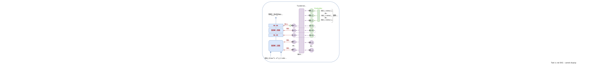
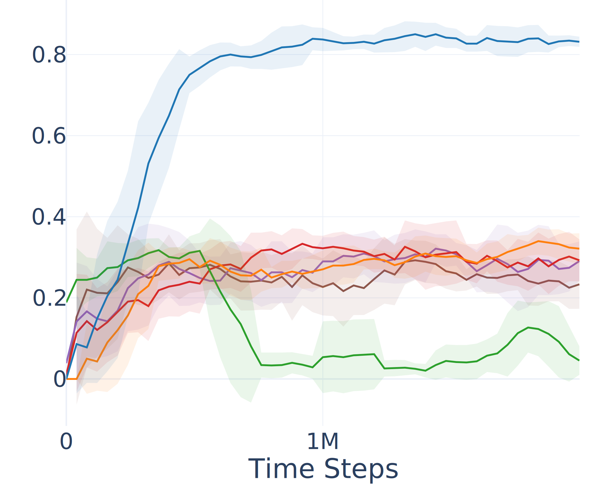
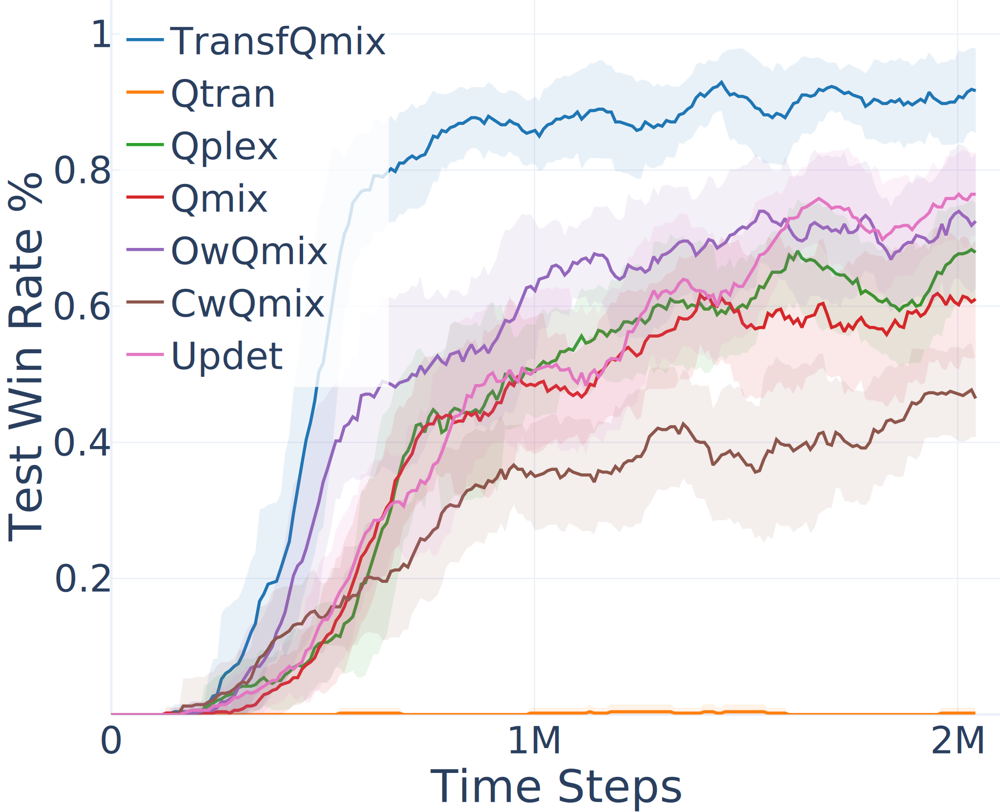
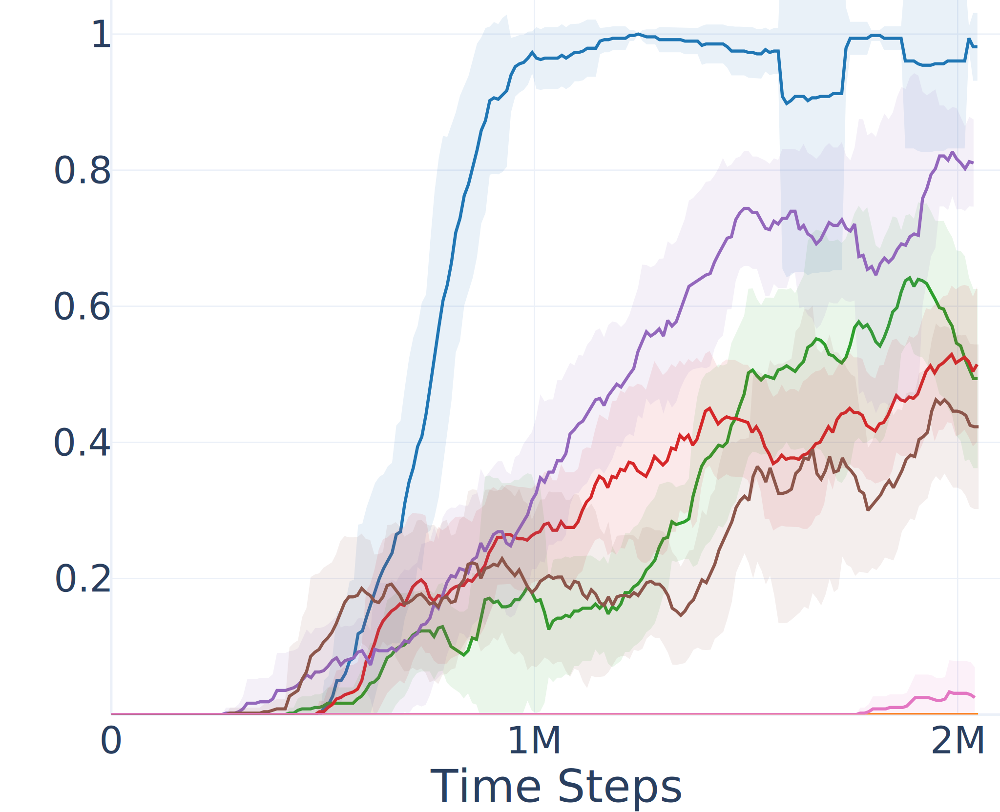
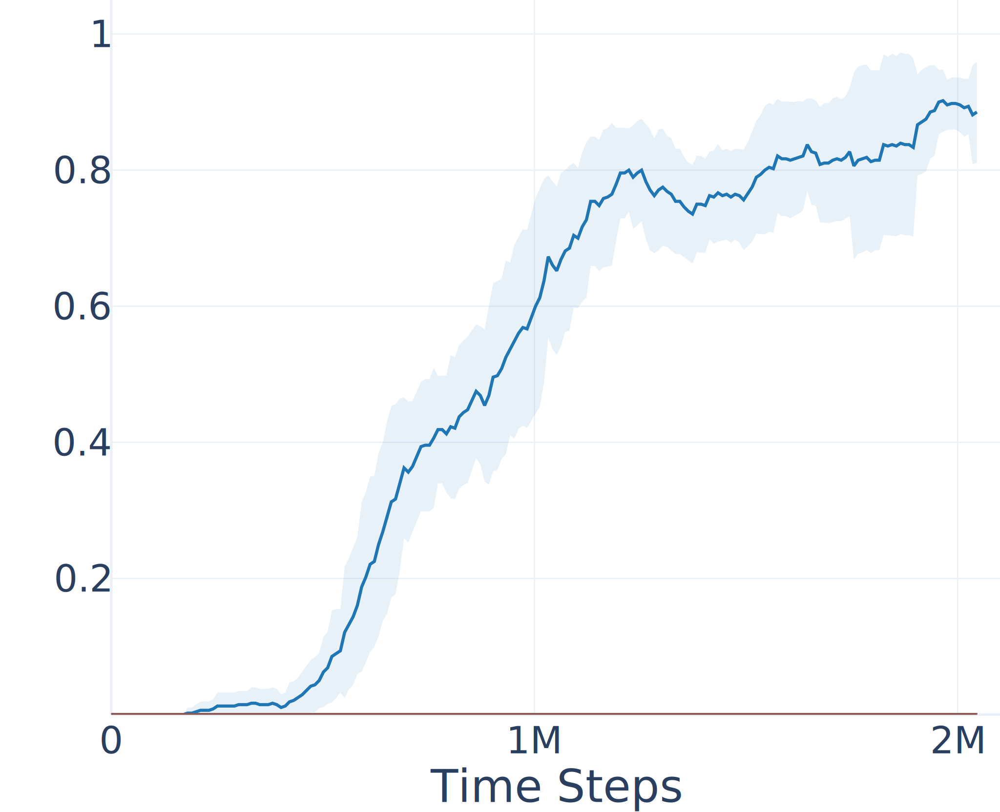

# TransfQMix: Transformers for Leveraging the Graph Structure of Multi-Agent Reinforcement Learning Problems

#### Matteo Gallici, Mario Martín, Ivan Masmitja

KEMLG research, Universitat Polítecnica de Catalunia, and ICM-CISCL.
AAMAS 2023

London, 1st June 2023

 

--- 
<!-- class: invert -->
<!-- paginate: false -->
# 1. Motivations
---
<!-- class: -->
<!-- paginate: true -->

## What are exactly observations and states in MARL?

- State-of-the-art approaches in MARL (MADDPG, VDN, QTran, QMix, QPlex, MAPPO, DICG) **focus on the learning architecture.** 

- No looking into observations and states: concatenations of features feeded to NNs.

- Where those features come from?

---

## Information Channels

- Information usually come from multiple sources: *observed entities, different sensors, communication channels.*
- Agents can differentiate between information channels, because they occupy always the **same vector positions**. 

<!-- if agents can differentiate between information sources, why not to process them coherently  -->
---

## Entities features

- Often, a subset of **identical** features describe different the observed entities.
- **This is a graph structure!**
  - Vertices -> entities features
  - Edges -> ?
- Self-Attention can be used to learn the edges of the latent graph ([Li et al., 2021](https://arxiv.org/abs/2006.11438)).

---

## Observations and State Matrices

- We reformulate the entire MARL problem in terms of graphs.
- The inputs to NNs are well-structured vertex features.
- The goal of the NNs is to learn the **latent coordination graph**.

$$
\begin{eqnarray}
\mathbf{O}_t^a = 
\begin{bmatrix}
ent_1
\\ \vdots \\ 
ent_k
\end{bmatrix}_t^a =
\begin{bmatrix}
f_{1,1} & \cdots & f_{1,z} \\
\vdots & \ddots & \vdots \\ 
f_{k,1} & \cdots & f_{k,z}
\end{bmatrix}
_t^a
\end{eqnarray}
$$

**Observation Matrix**

Includes vertices of the graph observed by the agent $a$ at time step $t$.

$$
\begin{eqnarray}
\label{eq:state}
\mathbf{S}_t = 
\begin{bmatrix}
ent_1
\\ \vdots \\ 
ent_k
\end{bmatrix}_t = 
\begin{bmatrix}
f_{1,1} & \cdots & f_{1,z} \\
\vdots & \ddots & \vdots \\ 
f_{k,1} & \cdots & f_{k,z}
\end{bmatrix}_t
\end{eqnarray}
$$

**State Matrix**

Describe the complete graph of the environment at time step $t$.

---

## Graph-approach advantages

1. Better represents coordination problems.
2. Allow use of more appropriate NNs (GNN, Transformers).
3. Makes the NNs parameters **invariant to the number of agents**.
4. Makes transfer learning and curriculum learning easy to implement.

## Disadvantages

1. Cannot differentiate entities a-priori in observations, f.i. raw images (although we can for states).
2. Cannot directly include last action and one hot enconding of agent id in the observation. 

--- 

## Additional features

- Some information get lost when dropping concatenation:
  - which of vertices represent "me"? 
  - which of the vertices are "collaborative agents"?
- Easier solution are flags into the vertex features:

 

$$
\begin{eqnarray}        
f_{i,\texttt{IS\_SELF}}^a =         \begin{cases}            1, & \text{if } i = a\\            0, & \text{otherwise.}        \end{cases}
\end{eqnarray}
$$

$$
\begin{eqnarray}        
f_{i, \texttt{IS\_AGENT}}^a =         
\begin{cases}            1, & \text{if } i \in A\\            0, & \text{otherwise}        \end{cases}    
\end{eqnarray}
$$

--- 
<!-- class: invert -->
<!-- paginate: false -->
# 2. TransfQMix
---
<!-- paginate: true -->
<!-- class: -->

## Main features

- Extends QMix with the use graph matrices and transformers.
  - Independent q-learners.
  - Centralized mixer which respects the monotonicity constraint.
- Graph reasoning in **both the agents and mixer**.
  - UPDET [(Hu et al. 2022)](https://arxiv.org/abs/2101.08001): self-attention in agents.
  - QPlex [(Wang et al. 2021)](https://link.springer.com/article/10.1140/epjd/e2017-80024-y), DICG [(Li et al. 2021)](https://arxiv.org/abs/2006.11438): self-attention in mixer.

---
## Transformer Agent

Similar architecture to UPDET, but:
- Q-Values are derived from the agent hidden state, reinforcing reccurent passing of gradient.
- Separete output layer used for Policy Decoupling.

---
## Transformer Mixer

Transformer hypernetwork:
- Agents hidden states:
  - $W_1$: q-values embedding
- Recurrent mechanism:
  - $b1, W2, b2$: projection over $Q_{tot}$
- State embedder:
  - environment reasoning

---

--- 
<!-- class: invert -->
<!-- paginate: false -->
# 3. Experiments
---
<!-- class: -->
<!-- paginate: true -->

## Spread

Setup:
- Observation entity features: $pos_x$, $pos_y$
- State entity features: position+velocity.
- Extended to 6 agents (normally only 3)
- Reward: *sum of minimum distances from each landmark to any agent*.
- Reported evaluation metric: **percentage of landmarks occupied** at the conclusion of an episode (**POL**)

---
## Spread Results

Spread 3v3

Spread 4v4

Spread 5v5

Spread 6v6

---
## StarCraft 2
Setup:
- Original state and observations already used a graph-based observation and state
- Reported results for the hardest maps in literature.

---
## SC2 Results

5m_vs_6m

8m_vs_9m

27m_vs_30m

6h_vs_8z

5m_vs_6m

3s5z_vs_3s6z

MM2

corridor

---
## Model Size

| **Model**   | **Agent** | **Mixer** |
|-------------|-----------|-----------|
| TransfQMix  | 50k       | 50k       |
| QMix        | 27k       | 18k       |
| QPlex       | 27k       | 251k      |
| O-CWQMix    | 27k       | 179k      |

Spread 3v3

| **Model**   | **Agent** | **Mixer** |
|-------------|-----------|-----------|
| TransfQMix  | 50k       | 50k       |
| QMix        | 28k       | 56k       |
| QPlex       | 28k       | 597k      |
| O-CWQMix    | 28k       | 301k      |

Spread 6v6

| **Model**   | **Agent** | **Mixer** |
|-------------|-----------|-----------|
| TransfQMix  | 50k       | 50k       |
| QMix        | 49k       | 283k      |
| QPlex       | 49k       | 3184k     |
| O-CWQMix    | 49k       | 1021k     |

SC2 27m_vs_30m

---
## Zero-Shot Transfer

Spread: **the learned policy is transferable between different team of agents**.

| **Model**        | **3v3** | **4v4** | **5v5** | **6v6** |
|------------------|---------|---------|---------|---------|
| TransfQMix (3v3) | **0.98**| 0.88    | 0.8     | 0.75    |
| TransfQMix (4v4) | 0.96    | **0.93**| **0.9** | 0.86    |
| TransfQMix (5v5) | 0.88    | 0.85    | 0.82    | 0.82    |
| TransfQMix (6v6) | 0.91    | 0.88    | 0.85    | 0.84    |
| TransfQMix (CL)  | 0.88    | 0.88    | 0.87    | **0.87**|
| State-of-the-art | 0.76    | 0.45    | 0.36    | 0.33    |

---
## Transfer Learning

SC2: **learning can be speeded up by transferring a learned policy.**

8m_vs_9m to 5m_vs_6m

5s10z to 3s5z_vs_3s6z

---
<!-- paginate: false -->
<!-- class: invert -->
# 6. Summary and Future Work

---
<!-- paginate: true -->
## Key Contributions: 

- Graph-based formalization of Multi-Agent Reinforcement Learning (MARL) coordination problems.
- New QMix-like architecture fully based on transformers.
- Promising results in transfer learning, zero-shot transfer, and curriculum learning.

---
## Future Work:

- Explore TransfQMix's generalization capabilities by integrating several tasks into a single learning pipeline (training same agents to solve all SC2 tasks).
- Examining the feasibility of transferring coordination policies between different MARL domains.
- Influence of multi-head self-attention on coordination reasoning will be investigated more thoroughly.

---
<!-- paginate: false -->
<!-- class: -->

# Thank you!

### Acknowledgments:
-  EU’s Horizon 2020 research and innovation programme under the Marie Skłodowska-Curie grant agreement No 893089.
- Severo Ochoa Centre of Excellence accreditation (CEX2019-000928-S). 
- David and Lucile Packard Foundation. 
- Barcelona Supercomputing Center in collaboration with the HPAI group.

---
<!-- paginate: false -->

## Ablation

SC2: 5m_vs_6m

Spread: 6v6

